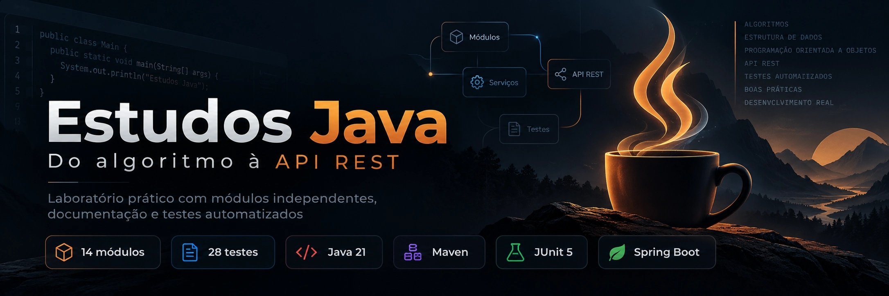

<p align="center">
  <a href="02-fundamentos-java/README.md"></a>
  <a href="pom.xml"></a>
  <a href="docs/QUALIDADE.md"></a>
  <a href="14-spring-boot/README.md"></a>
</p>

<p align="center">
  <a href="10-javafx/README.md"></a>
  <a href="11-banco-relacional/README.md"></a>
  <a href="12-banco-nosql/README.md"></a>
  <a href="13-jpa-hibernate/README.md"></a>
  <a href="docs/QUALIDADE.md"></a>
  <a href=".github/workflows/ci.yml"></a>
</p>

# Estudos Java

Laboratório de código para estudar **do algoritmo à API REST**, com exemplos de negócio, testes automatizados e documentação de decisões. Os módulos são independentes: cada um pode ser compilado e executado sem conhecer a implementação dos demais.

> **Stack:** Java 21 (LTS), Maven, JUnit 5, JavaFX, JDBC/H2, MongoDB, JPA/Hibernate e Spring Boot.

## Tópicos e tecnologias

Os assuntos foram separados por contexto, com código e documentação próprios para facilitar a consulta:

- **Fundamentos:** [algoritmos e estruturas de dados](01-algoritmos-estruturas/README.md), [Java 21](02-fundamentos-java/README.md), [controle de fluxo](03-estruturas-controle/README.md) e [classes e objetos](04-classes-objetos-metodos/README.md).
- **Orientação a objetos:** [composição e colaboração](05-orientacao-objetos/README.md), [encapsulamento, herança, polimorfismo e abstração](06-pilares-poo/README.md).
- **Java funcional:** [lambdas](07-lambdas/README.md), [Stream API](08-stream-api/README.md) e [tratamento de exceções](09-tratamento-excecoes/README.md).
- **Interfaces e dados:** [JavaFX](10-javafx/README.md), [SQL/JDBC](11-banco-relacional/README.md), [MongoDB](12-banco-nosql/README.md) e [JPA/Hibernate](13-jpa-hibernate/README.md).
- **Back-end e qualidade:** [Spring Boot e API REST](14-spring-boot/README.md), [testes e boas práticas](docs/QUALIDADE.md), [arquitetura](docs/ARQUITETURA.md) e [integração contínua](.github/workflows/ci.yml).

<sub>Os badges de quantidade representam a validação local de 08/10/2026 e não são métricas em tempo real.</sub>

## Sumário

| Etapa | Conteúdo | Cenário aplicado | Código |
|:--:|---|---|---|
| 01 | [Algoritmos e estruturas de dados](01-algoritmos-estruturas/README.md) | Filas de prioridade, buscas e grafos para organizar atendimentos e rotas. | [`01-algoritmos-estruturas/src`](01-algoritmos-estruturas/src) |
| 02 | [Fundamentos da linguagem Java](02-fundamentos-java/README.md) | Tipos, precisão monetária, métodos estáticos, enums e imutabilidade. | [`02-fundamentos-java/src`](02-fundamentos-java/src) |
| 03 | [Estruturas de controle](03-estruturas-controle/README.md) | Condições, loops, switch expressions e validação de regras. | [`03-estruturas-controle/src`](03-estruturas-controle/src) |
| 04 | [Classes, objetos e métodos](04-classes-objetos-metodos/README.md) | Modelagem de um carrinho de compras e invariantes de domínio. | [`04-classes-objetos-metodos/src`](04-classes-objetos-metodos/src) |
| 05 | [Orientação a objetos](05-orientacao-objetos/README.md) | Composição e colaboração entre classes em uma biblioteca. | [`05-orientacao-objetos/src`](05-orientacao-objetos/src) |
| 06 | [Encapsulamento, herança, polimorfismo e abstração](06-pilares-poo/README.md) | Contas com políticas diferentes de saque. | [`06-pilares-poo/src`](06-pilares-poo/src) |
| 07 | [Lambdas](07-lambdas/README.md) | Predicados, funções, comparadores e composição de políticas. | [`07-lambdas/src`](07-lambdas/src) |
| 08 | [Stream API](08-stream-api/README.md) | Agrupamento, redução e relatórios de vendas. | [`08-stream-api/src`](08-stream-api/src) |
| 09 | [Tratamento de exceções](09-tratamento-excecoes/README.md) | Importação de arquivos com erros contextualizados e recursos fechados. | [`09-tratamento-excecoes/src`](09-tratamento-excecoes/src) |
| 10 | [JavaFX](10-javafx/README.md) | Aplicação gráfica de tarefas com regras isoladas da interface. | [`10-javafx/src`](10-javafx/src) |
| 11 | [Banco de dados relacional](11-banco-relacional/README.md) | SQL, JDBC, prepared statements e rollback de transações. | [`11-banco-relacional/src`](11-banco-relacional/src) |
| 12 | [Banco de dados não relacional (NoSQL)](12-banco-nosql/README.md) | MongoDB, documentos e atualizações atômicas. | [`12-banco-nosql/src`](12-banco-nosql/src) |
| 13 | [JPA (Hibernate)](13-jpa-hibernate/README.md) | Entidades, relacionamentos e ciclo de persistência. | [`13-jpa-hibernate/src`](13-jpa-hibernate/src) |
| 14 | [Spring Boot](14-spring-boot/README.md) | API REST de reservas: camadas, validação e testes HTTP. | [`14-spring-boot/src`](14-spring-boot/src) |


## Como executar

**Requisitos:** JDK 21 ou superior e conexão com a internet na primeira compilação. O wrapper Maven está incluído, então não é necessário instalar Maven globalmente.

```bash
# Linux/macOS
./mvnw verify

# Windows PowerShell
.\mvnw.cmd verify

# Executar apenas um módulo (exemplo)
./mvnw -pl 01-algoritmos-estruturas -DskipTests package
./mvnw -pl 01-algoritmos-estruturas exec:java -Dexec.mainClass=br.dev.estudos.algoritmos.Demonstracao
```

Os módulos com tecnologias externas têm orientações próprias: **JavaFX requer sessão gráfica**; **MongoDB requer um servidor** (veja `12-banco-nosql/compose.yaml`); **Spring Boot inicia uma API HTTP**, ver exemplo de `curl` na documentação do módulo.

## Como ler este repositório

1. Consulte o [roteiro de aprendizado](docs/ROTEIRO.md) e escolha uma etapa.
2. Leia o `README.md` do módulo para entender o problema, as escolhas e as limitações.
3. Rode a aplicação (`Demonstracao` ou comando próprio), depois os testes do módulo.
4. Altere um caso de negócio, acrescente testes e compare o comportamento.

## Organização e arquitetura

```text
estudos-java/
├── docs/                      # roteiro, arquitetura, qualidade e glossário
├── 01-algoritmos-estruturas/  # Java puro, 1 domínio por módulo
├── ...
├── 10-javafx/                # interface gráfica + serviços independentes
├── 11-banco-relacional/      # JDBC + transações
├── 12-banco-nosql/           # MongoDB + modelo documental
├── 13-jpa-hibernate/         # mapeamento objeto-relacional
├── 14-spring-boot/           # controller -> service -> repository
└── .github/workflows/ci.yml # compilação e testes
```

A maioria dos módulos separa código de produção (`src/main/java`) de teste (`src/test/java`). Recursos SQL e configurações ficam em `src/main/resources`. O `pom.xml` da raiz controla versões compartilhadas; cada módulo declara apenas o que utiliza. **Não há conexão de produção, chaves ou senhas no código.**

## Evidências práticas

- Implementações executáveis, não apenas pseudocódigo.
- Testes para fluxo feliz, validações e casos de erro.
- CI no GitHub Actions com build completo usando Java 21.
- Persistência por três abordagens diferentes: JDBC, documentos e ORM.
- API REST com validação, tratamento de erros e integração HTTP.
- Projeto gráfico separado para não misturar dependências de UI com aplicações de console.

## Materiais complementares

[Arquitetura e decisões](docs/ARQUITETURA.md) · [Mapa de competências](docs/COMPETENCIAS.md) · [Roteiro de estudos](docs/ROTEIRO.md) · [Critérios de qualidade](docs/QUALIDADE.md) · [Glossário](docs/GLOSSARIO.md)

Licença: MIT. Os exemplos usam domínios fictícios e não representam sistemas prontos para produção.
