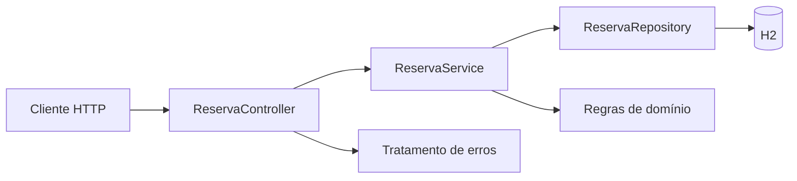

# Arquitetura e decisões

## Objetivo

Os exemplos demonstram **quando** usar um recurso e **por que** ele é útil, não apenas a assinatura de métodos. O domínio é deliberadamente pequeno para que cada assunto tenha um foco verificável.

## Estratégia

- **Independência:** não há dependências entre módulos. Assim, é possível estudar JDBC antes de Spring, por exemplo, sem carregar frameworks desnecessários.
- **Modelagem explícita:** classes de domínio protegem suas invariantes em construtores e operações; clientes não podem deixar entidades inválidas por acesso direto ao estado.
- **Testabilidade:** regra de negócio não fica dentro do `main`, controller HTTP ou botão do JavaFX.
- **Tratamento de erros:** violações de contrato falham com mensagens úteis; IO e infraestrutura são tratados nas bordas.
- **Dados:** JDBC torna SQL e transações explícitos; Hibernate demonstra ORM e contexto de persistência; MongoDB demonstra coleções e operações por documento.

## API REST (módulo 14)

O endpoint não conhece SQL. O serviço controla validações de regras, e o repositório abstrai o acesso à base. Essa divisão facilita testes e evolução da implementação.

## O que está fora de escopo

Exemplos pedagógicos não incluem autenticação corporativa, observabilidade distribuída, migrações produtivas, gestão de segredos por cofre e HA. Há orientações de evolução nos módulos. Essa delimitação é intencional — não equivale a afirmar prontidão para produção.
